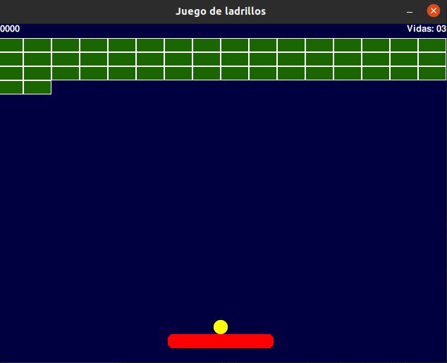
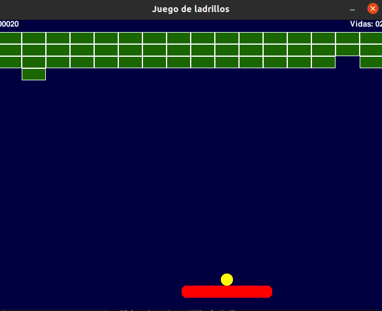

## VENTANA PRINCIPAL
### En esta ventana podemos ver como se ve la interfaz del juego para asi poder jugar el juego tiene 3 vidas si pasa la bolita a bajo de la paleta o de la barra sera como una vida menos para asi poder terminar el juego
 

## VENTANA 2
### En este juego podemos ver que cuando la pelota va para un ladrillo este se comvierte en puntos que cuando terminemos todos los ladrillos nos dira "GANASTE EL JUEGO :)" pero si perdemos nos dira "PERDISTE EL JUEGO :(" y este seria el juego totalmente 
